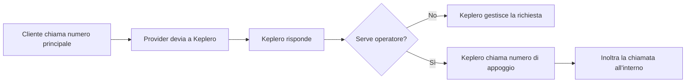
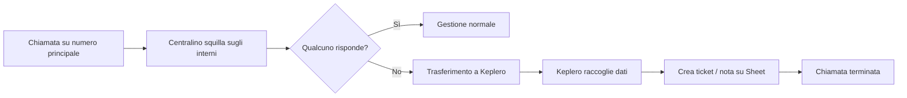
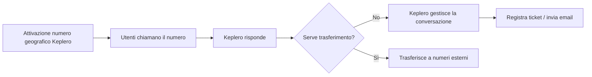
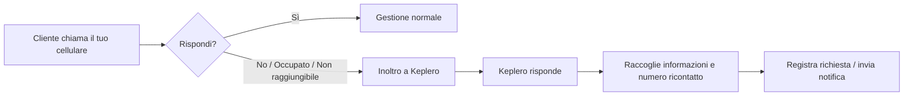
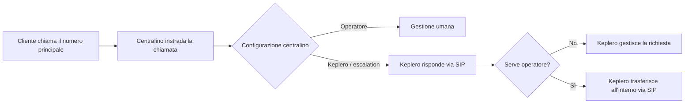

Quando integri Keplero con il sistema telefonico della tua azienda, puoi scegliere tra **5 modalità operative**. La scelta dipende da come vuoi che Keplero gestisca le chiamate in ingresso.

## Panoramica delle modalità operative

| Modalità                                         | Chi risponde per primo | Quando entra Keplero                                      | Numero chiamante | Trasferimento interni        | Centralino richiesto | Quando sceglierla                                           |
| ------------------------------------------------ | ---------------------- | --------------------------------------------------------- | ---------------- | ---------------------------- | -------------------- | ----------------------------------------------------------- |
| **1. Keplero risponde a tutte le chiamate**      | Keplero                | Subito                                                    | ✅ Preservato    | ✅ Sì                        | ✅ Sì                | Keplero è la voce principale e deve trasferire agli interni |
| **2. Keplero risponde solo se nessuno risponde** | Centralino             | In caso di mancata risposta                               | ❌ Perso         | ❌ No                        | ✅ Sì                | Come fallback / segreteria intelligente di un centralino    |
| **3. Chiamata diretta al numero di Keplero**     | Keplero                | Sempre                                                    | ✅ Preservato    | ✅ Sì (verso numeri esterni) | ❌ No                | Per attivare un nuovo numero (anche con prefisso custom)    |
| **4. Inoltro da cellulare verso Keplero**        | Keplero                | In caso di occupato, nessuna risposta o non raggiungibile | ❌ Perso         | ✅ Sì (verso numeri esterni) | ❌ No                | Come segreteria intelligente di uno o più cellulari         |
| **5. Integrazione SIP nativa con il centralino** | Dipende dal centralino (configurabile) | Come interno (configurabile dal centralino) | ✅ Preservato | ✅ Sì (nativo via SIP) | ✅ Sì (con supporto SIP) | Integrazione nativa con un PBX SIP-based                     |

<CardGroup cols={2}>
  <Card
    color="#7780D4"
    title="Presenza di Centralino"
    icon="phone"
    href="#presenza-di-centralino"
  >
    Se il tuo numero di telefono è presidiato da un centralino, puoi installare
    Keplero su di esso in due modi: puoi far rispondere Keplero a tutte le
    chiamate oppure far rispondere Keplero solo se nessun altro operatore
    risponde.
  </Card>
  <Card
    color="#7780D4"
    title="Centralino assente"
    icon="mobile"
    href="#centralino-assente"
  >
    Se il tuo telefono non è presidiato da un centralino, puoi sfruttare il
    numero di Keplero che ti abbiamo fornito oppure trasferire tutte le chiamate
    che arrivano al tuo numero personale verso Keplero.
  </Card>
  <Card
    color="#7780D4"
    title="Integrazione SIP nativa"
    icon="network-wired"
    href="#integrazione-sip-nativa"
  >
    Se il tuo centralino supporta il protocollo SIP, puoi integrare Keplero come
    endpoint nativo del PBX: Keplero si registra come interno e può trasferire
    le chiamate agli altri interni senza deviazioni telefoniche.
  </Card>
</CardGroup>

---

## Presenza di Centralino

Se il tuo numero di telefono è presidiato da un centralino, puoi installare Keplero su di esso in due principali modalità operative.

### Modalità 1: Keplero risponde a tutte le chiamate

In questa modalità, Keplero risponde immediatamente a tutte le chiamate, diventando di fatto **la vostra voce aziendale**. Il centralino viene bypassato in ingresso, ma può essere utilizzato per trasferimenti in uscita.

<Info>
**Quando scegliere questa modalità**

Scegli questa modalità quando vuoi che Keplero risponda immediatamente a tutte le chiamate, diventando la principale voce aziendale. È ideale quando Keplero deve gestire le richieste iniziali e poi trasferire agli interni quando necessario.

</Info>

#### Procedura operativa

<Steps>
  <Step title="Verifica di avere un numero pubblico (geografico)">
    Generalmente collegato a un centralino che gestisce *coda* o *IVR*.
    <Warning>
      Non è possibile installare Keplero su un numero privato.
    </Warning>
  </Step>
  <Step title="Attivazione deviazione a livello di provider">
    Il provider del numero attiva un trasferimento del numero geografico direttamente verso il numero Keplero che vi è stato assegnato (*es. 0773…*).
    
    Caratteristiche di questa deviazione:
    - Trasferimento **a livello di centrale**, non del centralino
    - **Caller ID preservato**: Keplero vede il numero del chiamante
    - Il centralino **non riceve più chiamate** in ingresso
  </Step>
  <Step title="Configura un numero geografico di appoggio sul centralino">
    Serve un secondo numero con:
    - **IVR attivo**
    - Tasti configurati (*1, 2, 3…*) che rappresentano gli interni
  </Step>
  <Step title="Configurazione escalation su Keplero">
    Dalla tab **Addestramento** → **Voice Agent** → **Operatore Umano** si imposta:
    
    ```
    <numero_appoggio> W <tasto_IVR>
    ```

    In questo modo, Keplero:
    - Chiama il numero di appoggio
    - Attende l'IVR
    - Digita automaticamente il tasto corretto
    - Trasferisce al reparto o all'interno desiderato

  </Step>
</Steps>

#### Esempio flusso



1. Il cliente chiama il numero principale
2. Il provider devia la chiamata a Keplero
3. Keplero risponde
4. Gestisce richieste e informazioni
5. Se serve un operatore → Keplero chiama il numero di appoggio e inoltra la chiamata

---

### Modalità 2: Keplero risponde solo se nessun altro operatore risponde

In questa modalità, il centralino resta la prima linea. Keplero interviene solo se nessun interno risponde, svolgendo il ruolo di **segreteria intelligente**.

<Info>
**Quando scegliere questa modalità**

Scegli questa modalità quando desideri che il centralino resti la prima linea e che Keplero intervenga solo come fallback quando nessun interno risponde. È ideale per aziende che vogliono mantenere il flusso tradizionale ma avere una segreteria intelligente.

</Info>

#### Procedura operativa

<Steps>
  <Step title="Il centralino gestisce le chiamate in ingresso">
    Squilla sugli interni tramite coda, gruppi o altre logiche interne.
  </Step>
  <Step title="Trasferimento tradizionale verso Keplero in caso di mancata risposta">
    Si imposta sul centralino:
    <Tip>
      "Se nessuno risponde entro X secondi → trasferisci la chiamata a Keplero."
    </Tip>
    <Warning>
      Trasferimento **tradizionale**, *non del provider*. Con il trasferimento
      tradizionale, il numero originale del chiamante viene **perso**. Keplero
      riceve la chiamata senza vedere il numero dell'utente.
    </Warning>
  </Step>
</Steps>

#### Comportamento di Keplero

Poiché Keplero non può trasferire agli interni e non vede il numero del chiamante, il comportamento ideale dell'assistente AI da impostare è:

<Steps>
  <Step title="Raccogliere informazioni">
    - Motivo della chiamata - **Numero per essere ricontattati** (fondamentale!)
    - Dettagli aggiuntivi
  </Step>
  <Step title="Registrare la richiesta">
    - **Email automatica** (ticket) - **Google Sheets** tramite integrazione
  </Step>
  <Step title="Chiudere la chiamata">
    Confermare all'utente che sarà ricontattato.
  </Step>
</Steps>

<Note>
  Poiché il numero del chiamante viene perso, è **fondamentale** che Keplero
  chieda sempre all'utente il numero per essere ricontattato.
</Note>

#### Esempio flusso



1. Chiamata sul numero principale
2. Il centralino squilla sugli interni
3. Nessuno risponde
4. Trasferimento tradizionale verso Keplero
5. Keplero raccoglie dati e crea ticket / nota su Google Sheet
6. La chiamata termina

---

## Centralino assente

Se non disponi di un centralino, hai due opzioni per integrare Keplero nel tuo sistema telefonico.

### Modalità 3: Chiamata diretta al numero di Keplero

Questa è la modalità più semplice. Non hai un centralino e vuoi utilizzare **direttamente un numero Keplero** come numero telefonico aziendale.

<Info>
**Quando scegliere questa modalità**

Scegli questa modalità quando non possiedi un centralino e vuoi attivare un nuovo numero telefonico geografico gestito direttamente da Keplero. Puoi scegliere qualsiasi prefisso italiano.

</Info>


#### Procedura operativa

<Steps>
  <Step title="Richiedi un numero telefonico geografico">
    Saremo noi a fornirti un numero telefonico geografico. Puoi scegliere
    qualsiasi prefisso italiano. **Esempi di prefissi disponibili:** - **06** →
    Provincia di Roma - **02** → Provincia di Milano - **011** → Provincia di
    Torino - **055** → Provincia di Firenze
    <Warning>
      **Requisito obbligatorio per il prefisso desiderato** Per legge, è
      necessaria una carta d'identità di una persona residente nella provincia
      del prefisso scelto. Serve solo per l'attivazione.
    </Warning>
  </Step>
  <Step title="Gli utenti chiamano → Keplero risponde direttamente">
    Non ci sono intermediari: - Nessun centralino - Nessun IVR esterno - Nessuna
    configurazione aggiuntiva
  </Step>
  <Step title="Eventuale trasferimento verso numeri esterni">
    Poiché non esiste un centralino, Keplero può comunque chiamare: - Cellulari
    - Linee fisse - Numeri esterni dei vari reparti Se non deve trasferire la
    chiamata, può registrare ticket, inviare email, ecc.
  </Step>
</Steps>

#### Esempio flusso



1. Viene attivato un numero geografico fornito da Keplero
2. Gli utenti chiamano questo numero
3. Keplero risponde
4. Keplero gestisce la conversazione
5. Se necessario, Keplero può trasferire la chiamata a numeri esterni o registrare ticket, inviare email ecc.

---

### Modalità 4: Inoltro di chiamata da cellulare verso Keplero

In questa modalità, configuri l'inoltro di chiamata direttamente sul tuo smartphone. Se qualcuno chiama il tuo numero di cellulare e non rispondi (o sei occupato/non raggiungibile), la chiamata viene inoltrata automaticamente verso Keplero che funziona come una **segreteria intelligente**.

<Info>
**Quando scegliere questa modalità**

Scegli questa modalità se ricevi chiamate sul cellulare e vuoi che Keplero risponda come segreteria intelligente quando non puoi rispondere. È ideale per professionisti, liberi professionisti e piccole attività.

</Info>

<Note>
  Poiché il numero del chiamante viene perso con l'inoltro, Keplero deve
  **sempre chiedere all'utente il numero di ricontatto**.
</Note>

#### Procedura operativa

<Steps>
  <Step title="Recupera il numero di Keplero assegnato">
    Lo trovi in **Impostazioni** → **Canali** → **Telefono** (*nell'angolo in alto a destra della pagina*).
    <Tip>
      Per facilitare gli esempi che vedrai in seguito, ipotizziamo che il numero che ti abbiamo fornito sia il seguente 👉 **+39 0123 456789**
    </Tip>
  </Step>
  <Step title="Attiva l'inoltro di chiamata dal tuo telefono">
    I seguenti codici MMI devono essere digitati sul **tastierino telefonico** e confermati premendo il **tasto di chiamata**. Dopo aver chiamato, riceverai un messaggio di conferma.
    
    Puoi attivare uno o più dei seguenti scenari:

    <Tabs>
      <Tab title="Nessuna risposta">
        **Inoltra dopo 3-5 squilli**

        Utile quando non rispondi in tempo.

        ```
        **61*+390123456789#
        ```
      </Tab>
      <Tab title="Occupato">
        **Inoltra subito se sei già in chiamata**

        Utile quando sei impegnato in un'altra conversazione.

        ```
        **67*+390123456789#
        ```
      </Tab>
      <Tab title="Non raggiungibile">
        **Inoltra quando il telefono è spento o senza rete**

        Utile quando sei in zone senza copertura o il telefono è spento.

        ```
        **62*+390123456789#
        ```
      </Tab>
    </Tabs>

  </Step>
  <Step title="Verifica l'attivazione">
    Dopo aver digitato ogni codice e premuto il tasto di chiamata, riceverai un messaggio di conferma dall'operatore.
    
    <Check>
    Ripeti l'operazione per tutti gli scenari che vuoi attivare per un fallback completo.
    </Check>
  </Step>
</Steps>

#### Procedura passo-passo

1. Apri l'app **Telefono**
2. Accedi al **tastierino numerico**
3. Digita uno dei codici sopra
4. Premi il tasto **Chiama**
5. Attendi il messaggio di conferma
6. Ripeti per tutti gli scenari desiderati

#### Come disattivare gli inoltri

Se vuoi ripristinare la configurazione originale e disattivare tutti gli inoltri:

```
##002#
```

Premi il tasto di chiamata per confermare.

<Warning>
  Questo comando disattiva **tutti** gli inoltri di chiamata attivi sul tuo
  numero.
</Warning>

#### Esempio flusso



---

## Integrazione SIP nativa

Se il tuo centralino supporta il protocollo SIP, puoi integrare Keplero come **endpoint nativo** del PBX. Keplero si registra direttamente al centralino come se fosse un interno, senza bisogno di deviazioni telefoniche o numeri di appoggio.

### Modalità 5: Integrazione SIP nativa con il centralino

In questa modalità Keplero si registra al centralino tramite protocollo SIP, diventando a tutti gli effetti un **interno del PBX**. Il centralino può instradare le chiamate a Keplero secondo le proprie regole (risposta diretta, escalation, orari, ecc.) e Keplero può trasferire nativamente le chiamate agli altri interni.

<Info>
**Quando scegliere questa modalità**

Scegli questa modalità quando il tuo centralino supporta il protocollo SIP e vuoi un'integrazione nativa, senza deviazioni telefoniche o numeri di appoggio. È la soluzione più integrata: Keplero diventa un interno del PBX, il Caller ID del chiamante viene preservato e i trasferimenti agli interni avvengono in modo nativo.

</Info>

#### Procedura operativa

<Steps>
  <Step title="Recupera le credenziali SIP dal tuo centralino">
    Ti serviranno: **Auth username**, **Password** e **Dominio SIP** (*SIP realm*).
  </Step>
  <Step title="Apri la configurazione Centralino/SIP">
    In **Impostazioni** → **Canali** → **Telefono**, seleziona il tab **Centralino/SIP**.
  </Step>
  <Step title="Autenticazione">
    Inserisci **Auth username** e **Password**.
  </Step>
  <Step title="SIP Registration">
    Inserisci il **Dominio SIP** (*SIP realm*). Puoi lasciare gli altri campi vuoti.
  </Step>
  <Step title="SIP gateways">
    Inserisci il **Dominio SIP** (*SIP realm*), lasciando come porta predefinita **5060** UDP.
  </Step>
  <Step title="Riferimento">
    Inserisci l'**interno** a cui Keplero dovrà trasferire la telefonata (*ad esempio: 12*) e l'**etichetta** (*ad esempio: Centralino*).
  </Step>
  <Step title="Salva e verifica">
    Scorri in basso e clicca su **Salva**. Keplero mostrerà se la connessione è avvenuta correttamente o se è andata in errore.
    <Warning>
      In caso di errore di connessione, contatta il nostro Team Support per ricevere assistenza.
    </Warning>
  </Step>
  <Step title="Imposta l'escalation vocale">
    Da **Addestramento** → **Agente Vocale** → tab **Operatore Umano** → cliccando su **Nuovo**, imposta Keplero come destinatario dell'escalation.
    <Warning>
      In questa modalità gli interni devono essere impostati come **numeri** e non come interni classici del centralino: inserisci quindi il valore dell'interno nel campo **Numero**.
    </Warning>
  </Step>
</Steps>

#### Esempio flusso



1. Il cliente chiama il numero principale
2. Il centralino instrada la chiamata in base alle proprie regole
3. Keplero risponde via SIP
4. Gestisce richieste e informazioni
5. Se serve un operatore → Keplero trasferisce nativamente la chiamata all'interno via SIP

---

## Riepilogo

Le cinque modalità permettono di adattare Keplero a qualsiasi configurazione telefonica:

<CardGroup cols={2}>
  <Card title="Modalità 1" icon="phone-volume" color="#7780D4">
    **Keplero è la voce principale** Risponde a tutte le chiamate e può
    trasferire agli interni del centralino.
  </Card>
  <Card title="Modalità 2" icon="phone-missed" color="#7780D4">
    **Keplero come fallback** Interviene solo quando gli operatori non
    rispondono, funzionando come segreteria intelligente.
  </Card>
  <Card title="Modalità 3" icon="phone-plus" color="#7780D4">
    **Keplero è il punto unico** Risponde su un nuovo numero geografico senza
    bisogno di centralino.
  </Card>
  <Card title="Modalità 4" icon="mobile" color="#7780D4">
    **Keplero come segreteria** Risponde quando non puoi rispondere al
    cellulare, raccogliendo informazioni per te.
  </Card>
  <Card title="Modalità 5" icon="network-wired" color="#7780D4">
    **Integrazione SIP nativa** Keplero si registra come interno del centralino,
    con trasferimenti nativi agli interni e Caller ID preservato.
  </Card>
</CardGroup>
