```mermaid
flowchart LR
    A[Cliente chiama il tuo cellulare] --> B{Rispondi?}
    B -->|Sì| C[Gestione normale]
    B -->|No / Occupato / Non raggiungibile| D[Inoltro a Keplero]
    D --> E[Keplero risponde]
    E --> F[Raccoglie informazioni e numero ricontatto]
    F --> G[Registra richiesta / invia notifica]
```

Quando integri Keplero con il sistema telefonico della tua azienda, puoi scegliere tra **4 modalità operative**. La scelta dipende da come vuoi che Keplero gestisca le chiamate in ingresso.

## Panoramica delle modalità operative

| Modalità                                         | Chi risponde per primo | Quando entra Keplero                                      | Numero chiamante | Trasferimento interni        | Centralino richiesto | Quando sceglierla                                           |
| ------------------------------------------------ | ---------------------- | --------------------------------------------------------- | ---------------- | ---------------------------- | -------------------- | ----------------------------------------------------------- |
| **1. Keplero risponde a tutte le chiamate**      | Keplero                | Subito                                                    | ✅ Preservato    | ✅ Sì                        | ✅ Sì                | Keplero è la voce principale e deve trasferire agli interni |
| **2. Keplero risponde solo se nessuno risponde** | Centralino             | In caso di mancata risposta                               | ❌ Perso         | ❌ No                        | ✅ Sì                | Come fallback / segreteria intelligente di un centralino    |
| **3. Chiamata diretta al numero di Keplero**     | Keplero                | Sempre                                                    | ✅ Preservato    | ✅ Sì (verso numeri esterni) | ❌ No                | Per attivare un nuovo numero (anche con prefisso custom)    |
| **4. Inoltro da cellulare verso Keplero**        | Keplero                | In caso di occupato, nessuna risposta o non raggiungibile | ❌ Perso         | ✅ Sì (verso numeri esterni) | ❌ No                | Come segreteria intelligente di uno o più cellulari         |

<CardGroup cols={2}>
  <Card
    color="#7780D4"
    title="Presenza di Centralino"
    icon="phone"
    href="#presenza-di-centralino"
  >
    Se il tuo numero di telefono è presidiato da un centralino, puoi installare
    Keplero su di esso in due modi: puoi far rispondere Keplero a tutte le
    chiamate oppure far rispondere Keplero solo se nessun altro operatore
    risponde.
  </Card>
  <Card
    color="#7780D4"
    title="Centralino assente"
    icon="mobile"
    href="#centralino-assente"
  >
    Se il tuo telefono non è presidiato da un centralino, puoi sfruttare il
    numero di Keplero che ti abbiamo fornito oppure trasferire tutte le chiamate
    che arrivano al tuo numero personale verso Keplero.
  </Card>
</CardGroup>

---

## Presenza di Centralino

Se il tuo numero di telefono è presidiato da un centralino, puoi installare Keplero su di esso in due principali modalità operative.

### Modalità 1: Keplero risponde a tutte le chiamate

In questa modalità, Keplero risponde immediatamente a tutte le chiamate, diventando di fatto **la vostra voce aziendale**. Il centralino viene bypassato in ingresso, ma può essere utilizzato per trasferimenti in uscita.

<Info>
**Quando scegliere questa modalità**

Scegli questa modalità quando vuoi che Keplero risponda immediatamente a tutte le chiamate, diventando la principale voce aziendale. È ideale quando Keplero deve gestire le richieste iniziali e poi trasferire agli interni quando necessario.

</Info>

#### Procedura operativa

<Steps>
  <Step title="Verifica di avere un numero pubblico (geografico)">
    Generalmente collegato a un centralino che gestisce *coda* o *IVR*.
    <Warning>
      Non è possibile installare Keplero su un numero privato.
    </Warning>
  </Step>
  <Step title="Attivazione deviazione a livello di provider">
    Il provider del numero attiva un trasferimento del numero geografico direttamente verso il numero Keplero che vi è stato assegnato (*es. 0773…*).
    
    Caratteristiche di questa deviazione:
    - Trasferimento **a livello di centrale**, non del centralino
    - **Caller ID preservato**: Keplero vede il numero del chiamante
    - Il centralino **non riceve più chiamate** in ingresso
  </Step>
  <Step title="Configura un numero geografico di appoggio sul centralino">
    Serve un secondo numero con:
    - **IVR attivo**
    - Tasti configurati (*1, 2, 3…*) che rappresentano gli interni
  </Step>
  <Step title="Configurazione escalation su Keplero">
    Dalla tab **Addestramento** → **Voice Agent** → **Operatore Umano** si imposta:
    
    ```
    <numero_appoggio> W <tasto_IVR>
    ```

    In questo modo, Keplero:
    - Chiama il numero di appoggio
    - Attende l'IVR
    - Digita automaticamente il tasto corretto
    - Trasferisce al reparto o all'interno desiderato

  </Step>
</Steps>

#### Esempio flusso


1. Il cliente chiama il numero principale
2. Il provider devia la chiamata a Keplero
3. Keplero risponde
4. Gestisce richieste e informazioni
5. Se serve un operatore → Keplero chiama il numero di appoggio e inoltra la chiamata

---

### Modalità 2: Keplero risponde solo se nessun altro operatore risponde

In questa modalità, il centralino resta la prima linea. Keplero interviene solo se nessun interno risponde, svolgendo il ruolo di **segreteria intelligente**.

<Info>
**Quando scegliere questa modalità**

Scegli questa modalità quando desideri che il centralino resti la prima linea e che Keplero intervenga solo come fallback quando nessun interno risponde. È ideale per aziende che vogliono mantenere il flusso tradizionale ma avere una segreteria intelligente.

</Info>

<AccordionGroup>
  <Accordion title="Caratteristiche tecniche">
    | Caratteristica | Valore |
    | --- | --- |
    | Numero chiamante | ❌ Perso |
    | Trasferimento agli interni | ❌ No |
    | Centralino richiesto | ✅ Sì |
    | Tipo di deviazione | Trasferimento tradizionale dal centralino |
  </Accordion>
</AccordionGroup>

#### Procedura operativa

<Steps>
  <Step title="Il centralino gestisce le chiamate in ingresso">
    Squilla sugli interni tramite coda, gruppi o altre logiche interne.
  </Step>
  <Step title="Trasferimento tradizionale verso Keplero in caso di mancata risposta">
    Si imposta sul centralino:
    <Tip>
      "Se nessuno risponde entro X secondi → trasferisci la chiamata a Keplero."
    </Tip>
    <Warning>
      Trasferimento **tradizionale**, *non del provider*. Con il trasferimento
      tradizionale, il numero originale del chiamante viene **perso**. Keplero
      riceve la chiamata senza vedere il numero dell'utente.
    </Warning>
  </Step>
</Steps>

#### Comportamento di Keplero

Poiché Keplero non può trasferire agli interni e non vede il numero del chiamante, il comportamento ideale dell'assistente AI da impostare è:

<Steps>
  <Step title="Raccogliere informazioni">
    - Motivo della chiamata - **Numero per essere ricontattati** (fondamentale!)
    - Dettagli aggiuntivi
  </Step>
  <Step title="Registrare la richiesta">
    - **Email automatica** (ticket) - **Google Sheets** tramite integrazione
  </Step>
  <Step title="Chiudere la chiamata">
    Confermare all'utente che sarà ricontattato.
  </Step>
</Steps>

<Note>
  Poiché il numero del chiamante viene perso, è **fondamentale** che Keplero
  chieda sempre all'utente il numero per essere ricontattato.
</Note>

#### Esempio flusso



```mermaid
flowchart LR
    A[Chiamata su numero principale] --> B[Centralino squilla sugli interni]
    B --> C{Qualcuno risponde?}
    C -->|Sì| D[Gestione normale]
    C -->|No| E[Trasferimento a Keplero]
    E --> F[Keplero raccoglie dati]
    F --> G[Crea ticket / nota su Sheet]
    G --> H[Chiamata terminata]
```

1. Chiamata sul numero principale
2. Il centralino squilla sugli interni
3. Nessuno risponde
4. Trasferimento tradizionale verso Keplero
5. Keplero raccoglie dati e crea ticket / nota su Google Sheet
6. La chiamata termina

---

## Centralino assente

Se non disponi di un centralino, hai due opzioni per integrare Keplero nel tuo sistema telefonico.

### Modalità 3: Chiamata diretta al numero di Keplero

Questa è la modalità più semplice. Non hai un centralino e vuoi utilizzare **direttamente un numero Keplero** come numero telefonico aziendale.

<Info>
**Quando scegliere questa modalità**

Scegli questa modalità quando non possiedi un centralino e vuoi attivare un nuovo numero telefonico geografico gestito direttamente da Keplero. Puoi scegliere qualsiasi prefisso italiano.

</Info>

<AccordionGroup>
  <Accordion title="Caratteristiche tecniche">
    | Caratteristica | Valore |
    | --- | --- |
    | Numero chiamante | ✅ Preservato |
    | Trasferimento agli interni | ✅ Sì (verso numeri esterni) |
    | Centralino richiesto | ❌ No |
    | Setup | Nessuna configurazione aggiuntiva |
  </Accordion>
</AccordionGroup>

#### Procedura operativa

<Steps>
  <Step title="Richiedi un numero telefonico geografico">
    Saremo noi a fornirti un numero telefonico geografico. Puoi scegliere
    qualsiasi prefisso italiano. **Esempi di prefissi disponibili:** - **06** →
    Provincia di Roma - **02** → Provincia di Milano - **011** → Provincia di
    Torino - **055** → Provincia di Firenze
    <Warning>
      **Requisito obbligatorio per il prefisso desiderato** Per legge, è
      necessaria una carta d'identità di una persona residente nella provincia
      del prefisso scelto. Serve solo per l'attivazione.
    </Warning>
  </Step>
  <Step title="Gli utenti chiamano → Keplero risponde direttamente">
    Non ci sono intermediari: - Nessun centralino - Nessun IVR esterno - Nessuna
    configurazione aggiuntiva
  </Step>
  <Step title="Eventuale trasferimento verso numeri esterni">
    Poiché non esiste un centralino, Keplero può comunque chiamare: - Cellulari
    - Linee fisse - Numeri esterni dei vari reparti Se non deve trasferire la
    chiamata, può registrare ticket, inviare email, ecc.
  </Step>
</Steps>

#### Esempio flusso



```mermaid
flowchart LR
    A[Attivazione numero geografico Keplero] --> B[Utenti chiamano il numero]
    B --> C[Keplero risponde]
    C --> D{Serve trasferimento?}
    D -->|No| E[Keplero gestisce la conversazione]
    D -->|Sì| F[Trasferisce a numeri esterni]
    E --> G[Registra ticket / invia email]
```

1. Viene attivato un numero geografico fornito da Keplero
2. Gli utenti chiamano questo numero
3. Keplero risponde
4. Keplero gestisce la conversazione
5. Se necessario, Keplero può trasferire la chiamata a numeri esterni o registrare ticket, inviare email ecc.

---

### Modalità 4: Inoltro di chiamata da cellulare verso Keplero

In questa modalità, configuri l'inoltro di chiamata direttamente sul tuo smartphone. Se qualcuno chiama il tuo numero di cellulare e non rispondi (o sei occupato/non raggiungibile), la chiamata viene inoltrata automaticamente verso Keplero che funziona come una **segreteria intelligente**.

<Info>
**Quando scegliere questa modalità**

Scegli questa modalità se ricevi chiamate sul cellulare e vuoi che Keplero risponda come segreteria intelligente quando non puoi rispondere. È ideale per professionisti, liberi professionisti e piccole attività.

</Info>

<AccordionGroup>
  <Accordion title="Caratteristiche tecniche">
    | Caratteristica | Valore |
    | --- | --- |
    | Numero chiamante | ❌ Perso |
    | Trasferimento agli interni | ✅ Sì (verso numeri esterni) |
    | Centralino richiesto | ❌ No |
    | Gestione inoltro | A carico dell'operatore telefonico del cliente |
  </Accordion>
</AccordionGroup>

<Note>
  Poiché il numero del chiamante viene perso con l'inoltro, Keplero deve
  **sempre chiedere all'utente il numero di ricontatto**.
</Note>

#### Procedura operativa

<Steps>
  <Step title="Recupera il numero di Keplero assegnato">
    Lo trovi in **Impostazioni** → **Canali** → **Telefono** (*nell'angolo in alto a destra della pagina*).
    <Tip>
      Per facilitare gli esempi che vedrai in seguito, ipotizziamo che il numero che ti abbiamo fornito sia il seguente 👉 **+39 0123 456789**
    </Tip>
  </Step>
  <Step title="Attiva l'inoltro di chiamata dal tuo telefono">
    I seguenti codici MMI devono essere digitati sul **tastierino telefonico** e confermati premendo il **tasto di chiamata**. Dopo aver chiamato, riceverai un messaggio di conferma.
    
    Puoi attivare uno o più dei seguenti scenari:

    <Tabs>
      <Tab title="Nessuna risposta">
        **Inoltra dopo 3-5 squilli**

        Utile quando non rispondi in tempo.

        ```
        **61*+390123456789#
        ```
      </Tab>
      <Tab title="Occupato">
        **Inoltra subito se sei già in chiamata**

        Utile quando sei impegnato in un'altra conversazione.

        ```
        **67*+390123456789#
        ```
      </Tab>
      <Tab title="Non raggiungibile">
        **Inoltra quando il telefono è spento o senza rete**

        Utile quando sei in zone senza copertura o il telefono è spento.

        ```
        **62*+390123456789#
        ```
      </Tab>
    </Tabs>

  </Step>
  <Step title="Verifica l'attivazione">
    Dopo aver digitato ogni codice e premuto il tasto di chiamata, riceverai un messaggio di conferma dall'operatore.
    
    <Check>
    Ripeti l'operazione per tutti gli scenari che vuoi attivare per un fallback completo.
    </Check>
  </Step>
</Steps>

#### Procedura passo-passo

1. Apri l'app **Telefono**
2. Accedi al **tastierino numerico**
3. Digita uno dei codici sopra
4. Premi il tasto **Chiama**
5. Attendi il messaggio di conferma
6. Ripeti per tutti gli scenari desiderati

#### Come disattivare gli inoltri

Se vuoi ripristinare la configurazione originale e disattivare tutti gli inoltri:

```
##002#
```

Premi il tasto di chiamata per confermare.

<Warning>
  Questo comando disattiva **tutti** gli inoltri di chiamata attivi sul tuo
  numero.
</Warning>

#### Esempio flusso



---

## Riepilogo

Le quattro modalità permettono di adattare Keplero a qualsiasi configurazione telefonica:

<CardGroup cols={2}>
  <Card title="Modalità 1" icon="phone-volume" color="#7780D4">
    **Keplero è la voce principale** Risponde a tutte le chiamate e può
    trasferire agli interni del centralino.
  </Card>
  <Card title="Modalità 2" icon="phone-missed" color="#7780D4">
    **Keplero come fallback** Interviene solo quando gli operatori non
    rispondono, funzionando come segreteria intelligente.
  </Card>
  <Card title="Modalità 3" icon="phone-plus" color="#7780D4">
    **Keplero è il punto unico** Risponde su un nuovo numero geografico senza
    bisogno di centralino.
  </Card>
  <Card title="Modalità 4" icon="mobile" color="#7780D4">
    **Keplero come segreteria** Risponde quando non puoi rispondere al
    cellulare, raccogliendo informazioni per te.
  </Card>
</CardGroup>
