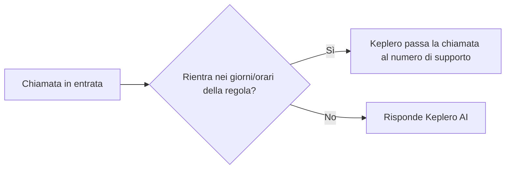

Puoi impostare Keplero in modo che **si disattivi automaticamente** in determinati giorni o fasce orarie, anche se **non hai un centralino**.

<Info>
Questa funzione è pensata per chi vuole scegliere manualmente quando far rispondere Keplero AI, senza dover intervenire ogni volta sulla deviazione di chiamata.
</Info>

## Come funziona

Quando arriva una chiamata sul tuo numero pubblico, Keplero controlla la fascia oraria configurata nella regola:

- **Dentro l'orario impostato**: Keplero **non risponde** e inoltra la chiamata al numero di supporto che hai indicato.
- **Fuori dall'orario impostato**: risponde **Keplero AI** normalmente.

## Cosa serve

Per configurare questa regola servono **due numeri di telefono**:

1. **Numero pubblico della tua attività**: quello che i clienti chiamano, e che devia verso Keplero.
2. **Numero di supporto**: quello che riceverà le chiamate quando Keplero è disattivato secondo la regola.

<Warning>
Il numero di supporto impostato nella regola **non deve coincidere** con il numero che devia le chiamate verso Keplero, altrimenti si crea un loop di inoltro.
</Warning>

<Tip>
Questa soluzione è ideale per chi ha **due SIM** — per esempio una personale e una lavorativa — e vuole scegliere se attivare o meno Keplero, anche senza centralino.
</Tip>

<Note>
Le chiamate inoltrate da Keplero quando è disattivato mostrano al numero di supporto il **numero originale del chiamante**, non il numero di Keplero.
</Note>

## Configurare la regola

<Steps>
  <Step title="Apri Impostazioni > Canali > Telefono > Regole">
    Dalla dashboard di Keplero, vai su **Impostazioni** → **Canali** → **Telefono**, quindi seleziona il tab **Regole**.
  </Step>

  <Step title="Apri Regole di instradamento delle chiamate">
    Clicca su **Regole di instradamento delle chiamate** e poi su **+ Aggiungi regola** in alto a destra.

    <Frame>
      
    </Frame>
  </Step>

  <Step title="Compila la nuova regola">
    Nella finestra **Aggiungi regola di instradamento chiamate**:

    - Assegna un **nome** alla regola.
    - Imposta **Rule type** su **Programma**.
    - Per ogni giorno della settimana, indica la fascia oraria in cui la regola deve essere attiva (puoi aggiungere più fasce con il pulsante **+**, o duplicarle sugli altri giorni con l'icona di copia).
    - Nel campo **poi**, seleziona **inoltra** e inserisci il **numero di supporto** a cui Keplero deve passare la chiamata durante quella fascia oraria.

    <Frame>
      
    </Frame>

    <Tip>
    Lascia vuoti i giorni in cui non vuoi che la regola sia attiva (ad esempio Sabato e Domenica, se Keplero deve restare sempre attivo nel weekend).
    </Tip>
  </Step>

  <Step title="Crea la regola">
    Clicca su **Crea regola** per salvare.

    <Check>
    La regola è attiva non appena viene salvata: nelle fasce orarie indicate, le chiamate verranno inoltrate automaticamente al numero di supporto invece di essere gestite da Keplero AI.
    </Check>
  </Step>
</Steps>
